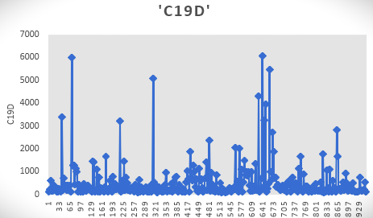
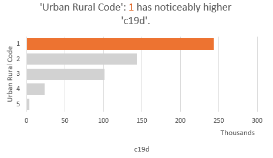
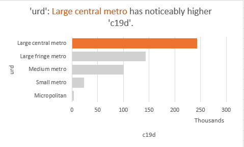
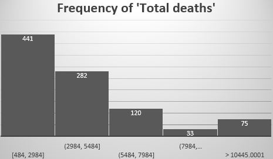

```{r setup, include=FALSE}
knitr::opts_chunk$set(echo = TRUE)
```

## In this assignment we will do exploratory data analysis and hypothesis testing on covid19 dataset that we have got.
### In this dataset there are 20 variables with all the variables indicating some kind of trend in COVID cases.


## Variable Description
### Legend : FIPS - Federal Information Processing Series
* Date as of : Date when the data was added in dataset
* Start week: Start data of survey
* End week: End data of survey
* State: State of subject
* County: County of subject
* Urban rural code: Rural-Urban Continuum Codes form a classification scheme that distinguishes metropolitan (metro) counties by the population size of their metro area, and nonmetropolitan (nonmetro) counties by degree of urbanization and adjacency to a metro area or areas
* FIPS State: FIPS state codes were numeric and two-letter alphabetic codes defined in U.S. Federal Information Processing Standard Publication ("FIPS PUB") 5-2 to identify U.S. states and certain other associated areas. ... The codes are used in Geographic Names Information System, overseen by the U.S. Board on Geographic Names.
* FIPS County: The Federal Information Processing Standard Publication 6-4 (FIPS 6-4) is a five-digit Federal Information Processing Standards code which uniquely identified counties and county equivalents in the United States, certain U.S. possessions, and certain freely associated states.
* FIPS Code: FIPS codes are numbers which uniquely identify geographic areas. The number of digits in FIPS codes vary depending on the level of geography
* Indicator: There are three survey patterns that are conducted for constructing this dataset on each county : Distribution of all-cause deaths (%), Distribution of COVID-19 deaths (%), Distribution of population (%)
* Total Deaths: Total deaths in the span of the survey
* COVID-19 Deaths: Deaths due to COVID-19
* Non-Hispanic White: Non-Hispanic whites are European Americans, Middle Eastern Americans, and North African Americans as defined by the United States Census Bureau. 
* Non-Hispanic Black: A person having origins in any of the black racial groups of Africa
* Non-Hispanic American Indian or Alaska Native: The term 'Alaska Native' are used in place of the word 'Indian' to include all indigenous people in Alaska.
* Non-Hispanic Asian:A person having origins in any of the original peoples of the Far East, Southeast Asia, or the Indian Subcontinent.
* Other: Groups not identified by any category
* Hispanic: A Spanish-speaking person, especially one of Latin American descent, living in the US.
* Urban Rural Description: The type and scale of urbanization of an area e.g. metro, small metro, etc.
* Footnote: An additional piece of information printed at the bottom of a page.


## Survey Description
### The survey conducted for building the dataset was done to infer the following:
* To show the trend of COVID-19 increase with time
* To monitor which counties have more spread of infection and which have less so as to prioritize the resources and medical response
* To establish a relation between urban/rural areas and COVID-19 infection
* To observe which groups of people among the vast variety of human population catches the infection more and why

## Metadata

The dataset was provided by teacher

1. Urban-Rural Description : For this variable there are no units as it is categorical data, for hypothesis testing we used mean/median. 
2. COVID-19 Deaths: It is numerical data without units, for hypothesis testing we used mean/median.
3. Distribution of all-cause death(%): Unit here is percentage 
4. Distribution of Covid-19 death(%): Unit here is percentage
5. There are some footnotes for some rows for all features
6. In many rows data based on counts less than 10 is suppressed

## What we are doing 
### We are going to setup a hypothesis test between urban rural description and covid-19 deaths variables; also we will see if there is any relationship between ‘Distribution of all-cause death(%)' and ‘Distribution of Covid-19 death(%)

* Part 1 - Hypothesis Testing
## Setting up hypotheses

## H₀ Null Hypothesis
### The null hypothesis urban areas project at least 700 COVID-19 deaths


## Hₐ Alternate Hypothesis
### The alternate hypothesis is that urban areas have no significant impact on rise in COVID-19 deaths

## R Code for hypothesis testing

```{r}
# Library Imports section

library(ggplot2)
```

```{r}

#Read Csv file
hp <- read.csv("covid.csv")
head(hp)
```

```{r}

urd <- hp$urd
c19d <- hp$c19d

df <- data.frame(urd,c19d)

head(df)

```

```{r}

mean_deaths <- mean(df$c19d)
mean_deaths

```
```{r}
standardDeviation <- sd(df$c19d)
standardDeviation
```


```{r}
n <- 5
```

```{r}
expected_deaths <- 700
```


```{r}
se <- standardDeviation/sqrt(n)

zScore <- (mean_deaths - expected_deaths)/se
zScore

p1<-pnorm(zScore,0,1)
p1

# if p1 < 0.05 reject null hypothesis
```

## Data Visualization

```{r}

# Box Plot for Urban Rural Description and COVID 19 Deaths

ggplot(data = df,aes(x = urd , y = c19d )) +
    geom_jitter(alpha = 0.1, color = "tomato") +
    geom_boxplot(alpha = 0)  

# Scatter plots

ggplot(df, aes(x=urd, y=c19d)) +
  geom_point(size=2, shape=23)

# Add marginal rugs
ggplot(df, aes(x=urd, y=c19d), color="cyl") +
  geom_point() + geom_rug()


```


## Let us analyze now the association between Distribution of all-cause deaths (%) and Distribution of COVID-19 deaths (%)

### We see that there is a difference between Distribution of all-cause deaths (%) and Distribution of COVID-19 deaths (%) w.r.t the different groups of US population like Hispanic and Non-Hispanic. 

### Though there is no clear trend here as for some kinds of people in certain regions the percentage of covid 19 deaths may be greater indicating total deaths in population is majorly due to COVID-19 and in some cases it is less indicating that other factors contribute more to the deaths.


## Excel/CSV Data Analysis
### In this section we have included some data analysis pictures done in excel relating to this database

  
<br>
<br>
<br>
<br>
  
<br>
<br>
<br>
<br>
  
<br>
<br>
<br>
<br>
  
<br>
<br>
<br>
<br>


## Conclusions

### We infer from this assignment that the urban areas of USA have shown more tendancy for covid19 related deaths overtime and there is an association between Distribution of all-cause deaths (%) and Distribution of COVID-19 deaths (%) which tells us if in a group of US population COVId19 is the major reason for deaths or not.

